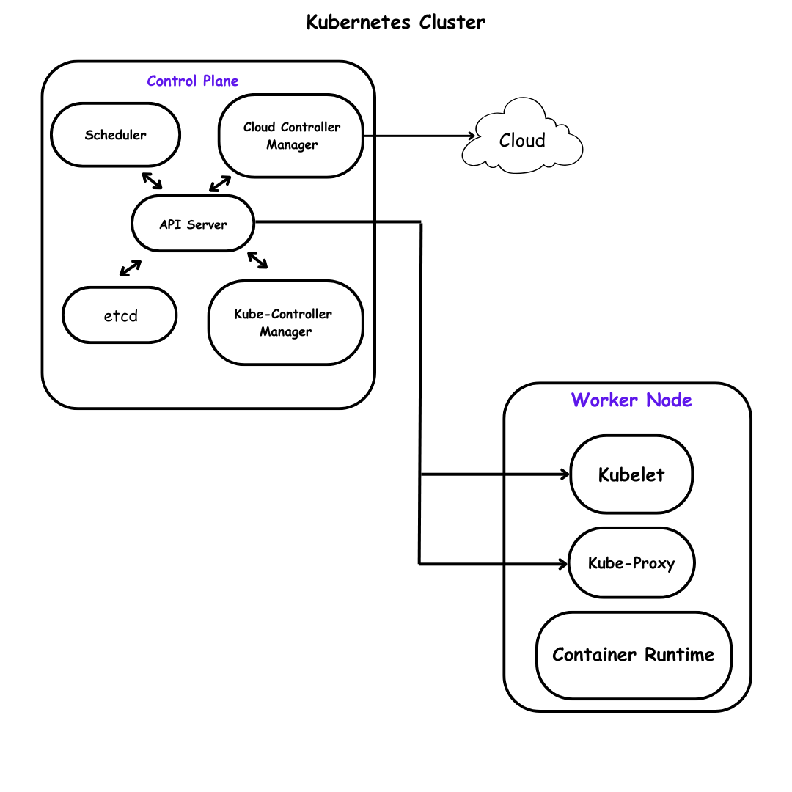

# Module 2

## Kubernetes Fundamentals: Core Concepts

In Module 1, we learned that Kubernetes is like a city planner for containers, managing them to keep applications running smoothly. Now, we’ll explore the core concepts of Kubernetes—pods, nodes, and clusters—and get hands-on with `kubectl`, the tool you’ll use to talk to Kubernetes. By the end of this module, you’ll understand how Kubernetes organizes applications and how to interact with a cluster.

### Learning Objectives:

- Understand pods, nodes, and clusters and how they work together.
- Learn the basics of Kubernetes architecture (control plane and worker nodes).
- Use kubectl to explore a Kubernetes cluster.

## What is a Kubernetes Cluster?

A Kubernetes cluster is like a city where your applications live. It’s made up of multiple servers (called nodes) working together to run your containers. Think of the cluster as the entire city, with different parts handling specific tasks.

A cluster has two main components:

- **Control Plane:** The city hall, which makes decisions and manages the cluster. It’s the brain of Kubernetes, handling tasks like scheduling containers and keeping everything in sync.

- **Worker Nodes:** The buildings where the actual work happens. These nodes run your applications inside containers.

Let’s break down the key pieces of this city.

## Pods: The Smallest Unit in Kubernetes

A **pod** is the smallest unit in Kubernetes, like an apartment in our city analogy. It’s where one or more containers live. Containers in the same pod share the same resources (like storage and network) and work closely together, like roommates sharing a kitchen.

For example:

- A pod might contain one container running a web server (e.g., Nginx).
- Or, it might have two containers: one running a web app and another running a logging tool that collects data from the app.

### Key Points about Pods:

- Pods are temporary. If one crashes, Kubernetes creates a new one.
- Each pod gets its own IP address, so containers inside can communicate easily.
- Pods are managed by Kubernetes, not created directly by you.

**Analogy:** Think of a pod as a lunch tray holding one or more dishes (containers). The tray makes it easy to move everything together, but if the tray breaks, the kitchen (Kubernetes) replaces it with a new one.

## Nodes: Where Pods Live

A **node** is a server (physical or virtual) in the Kubernetes cluster, like a building in our city. Nodes are where pods run. There are two types of nodes:

**Control Plane Nodes:** These run the components that manage the cluster, like the scheduler (decides where pods go) and the API server (handles communication).

**Worker Nodes:** These run your application pods. Each worker node has tools like the **kubelet** (a Kubernetes agent) that talks to the control plane and manages containers.

**Fun Fact:** A small cluster might have one node acting as both control plane and worker, like a small town where the mayor also runs the local shop. In bigger clusters, these roles are separated.

## Kubernetes Architecture: How It All Fits Together

Let’s put it together with a diagram :



**Explanation:**

- The **API Server** is like the city’s communication hub. You send commands to it (via `kubectl`), and it tells the cluster what to do.

- The **Scheduler** decides which node a pod should run on, based on resources and needs.

- The **Controller Manager** ensures the cluster stays in the desired state (e.g., replacing crashed pods).

- **etcd** is a database that stores the cluster’s configuration, like a city’s record book.

- **Cloud Controller Manager** allows Kubernetes to interact with the underlying cloud provider’s infrastructure. It is not optional if you're running Kubernetes on a cloud platform like AWS, GCP, Azure, etc., but optional if you're running Kubernetes on-premises or in an environment that doesn’t rely on a cloud provider's APIs.

**Worker nodes** run pods and include the following key components:

1. **Kubelet:**

- An agent that runs on each node.
- Ensures containers in pods are running as expected.
- Communicates with the control plane.

2. **Kube-proxy:**

- Handles network traffic to/from pods.
- Manages network rules for pod communication and services.

3. **Container Runtime:**
- Runs containers (e.g., containerd, CRI-O, Docker).
- Interfaces with kubelet to start/stop containers.

4. **Pods:**
- The smallest deployable units in Kubernetes, hosting one or more containers..

## Getting Started with `kubectl`
`kubectl` (pronounced “cube control”) is your command-line tool for interacting with Kubernetes, like a walkie-talkie to talk to the city hall. You’ll use it to create, inspect, and manage pods, nodes, and other resources.

**Basic Commands:**

- `kubectl get nodes`: Lists all nodes in the cluster.
- `kubectl get pods`: Lists all pods in the current namespace (a way to organize resources, like neighborhoods in a city).
- `kubectl describe pod <pod-name>`: Shows details about a specific pod.

## Hands-On Exercise: Explore a Kubernetes Cluster

Let’s try some `kubectl` commands using a free online sandbox. No installation is needed yet—we’ll cover setting up your own cluster later.

1. Go to **Play with Kubernetes** (https://labs.play-with-k8s.com/) or **Katacoda Kubernetes Playground** (https://www.katacoda.com/courses/kubernetes/playground).

2. Start a Kubernetes cluster as guided by the platform (usually takes 1-2 minutes).
3. Run these commands:

- `kubectl get nodes`
  - **What to expect:** A list of nodes (e.g., **node01**, **node02**) with their status (**Ready** or **NotReady**).


- `kubectl get pods --all-namespaces`
  - **What to expect:** A list of system pods running Kubernetes components (e.g., **kube-scheduler**, **etcd**).

4. Try creating a simple pod:
```kubectl run my-web-pod --image=nginx --restart=Never```

This creates a pod named **my-web-pod** running an Nginx web server.
Check it with **kubectl get pods**.
View details with **kubectl describe pod my-web-pod**.

**Note for Beginners:** If you’re not ready for hands-on, just follow along. The commands above show how Kubernetes organizes resources. We’ll do more hands-on in later modules.

## Quiz

1. What is a pod in Kubernetes?
- A) A server in the cluster.
- B) A database for storing cluster data.
- C) The smallest unit that holds one or more containers.


2. What does the control plane do?
- A) Runs application pods.
- B) Manages the cluster and makes decisions.
- C) Stores application data.


3. What command shows all nodes in a cluster?
- A) kubectl show pods
- B) kubectl describe cluster
- C) kubectl get nodes


**Answers:** 1-C, 2-B, 3-C

## Further Reading

- Kubernetes Documentation: Pods (https://kubernetes.io/docs/concepts/workloads/pods/)
- Kubernetes Documentation: Nodes (https://kubernetes.io/docs/concepts/architecture/nodes/)
- Interactive Tutorial: Learn `kubectl` (https://kubernetes.io/docs/tutorials/kubernetes-basics/explore/explore-intro/)

## What’s Next?
In Module 3, we’ll dive into **Containers and Docker Basics**, learning how containers are created and why they’re essential for Kubernetes. You’ll try running a container locally or in a sandbox to prepare for deploying apps in Kubernetes.

[Proceed to Module 3](https://wycliffealphus.github.io/Introduction-to-Kubernetes-and-Cloud-Native-Technologies/modules/03-Basics.html) →

